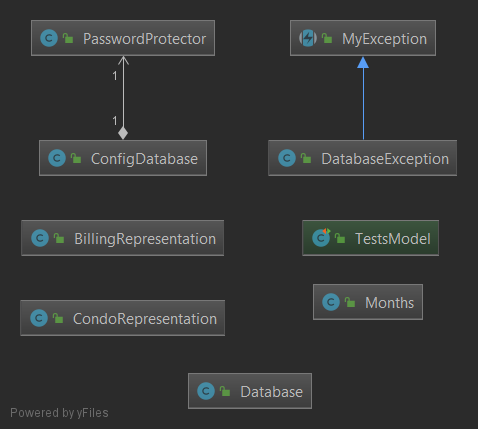
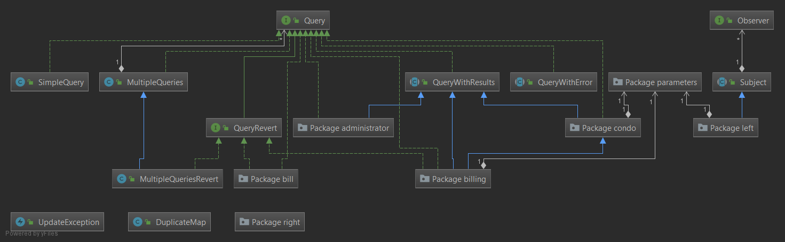
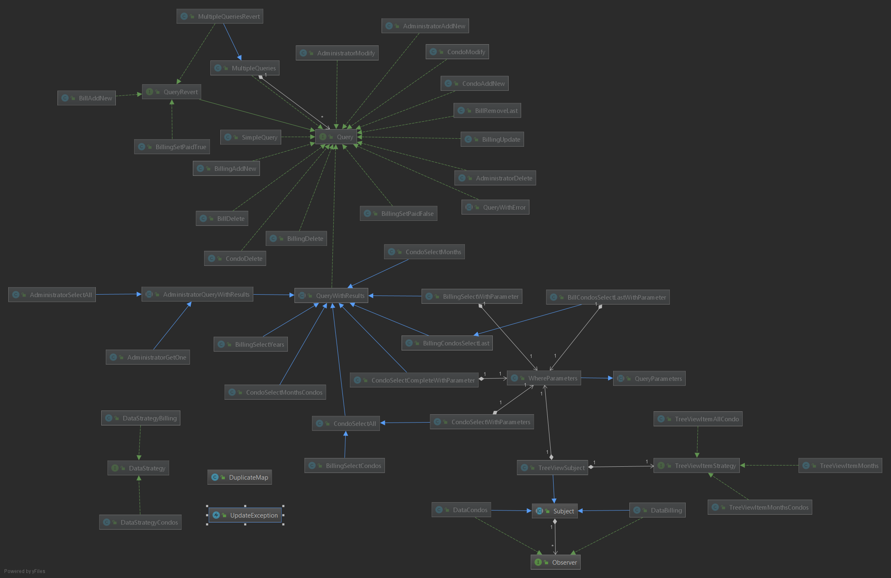
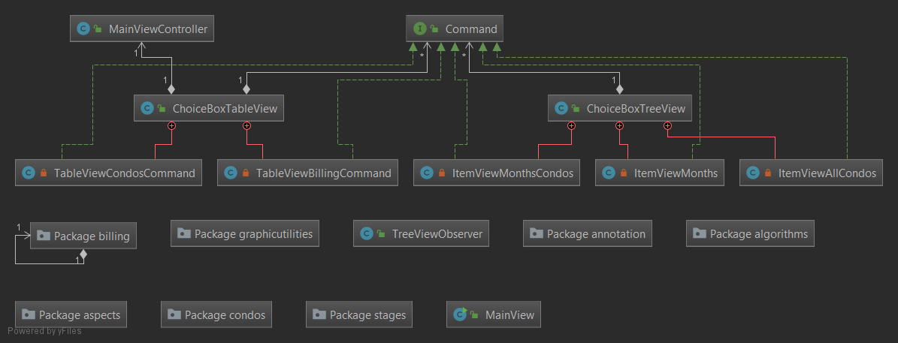

# Small Management Program 

This is a small management program made using Java, AspectJ and JavaFX.

## Installation

This program is independent of the operating system. To run it you have to:

- install [Java11](https://www.oracle.com/technetwork/java/javase/downloads/jdk11-downloads-5066655.html)  and configure correctly the environment variable `JAVA_HOME`;

- install [Gradle5](https://gradle.org/);

- create a Database and import the sql files contained in *database* directory;

- open a terminal in the main directory of the project and digit:

  ```bash
  gradle build
  gradle run
  ```

## Documentation

In this section are presented all UML Class Diagrams, divided by package.

### small_management_program


### model




### controller





### view

